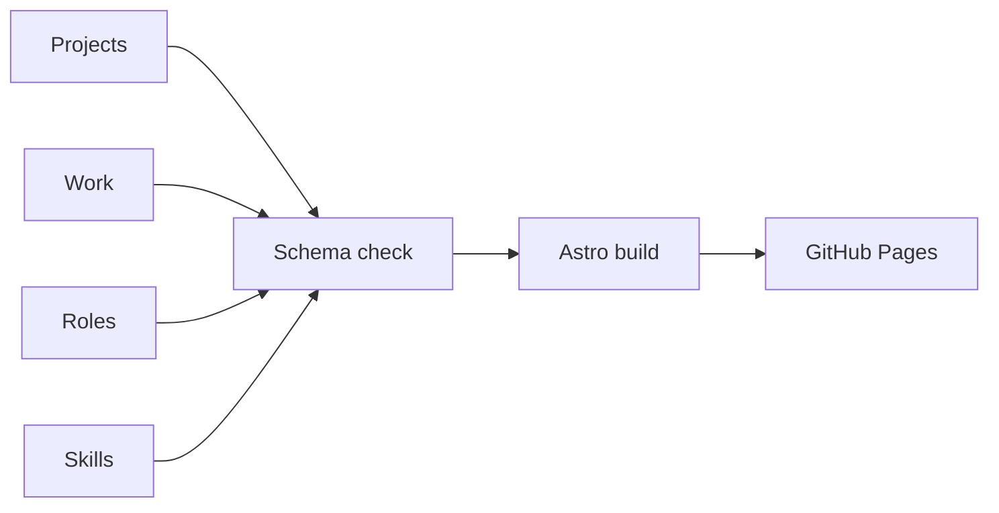

# Mikołaj Bigaj, portfolio

A static portfolio site for Mikołaj Bigaj, a backend engineer. It lists projects, work and roles, and shows which skills each of them used. Live at https://mbigaj.github.io.

## How it is built



The site is an Astro 7 project in TypeScript. Content lives in four collections: projects and work are Markdown files with frontmatter, roles and skills are JSON files. A zod schema in `src/content.config.ts` checks every entry, so a misspelled skill id or a malformed figure fails the build. The evidence shown for each skill is derived: a skill's page lists the projects, work and roles that reference it, so nothing is tallied by hand. Architecture diagrams are data (nodes on a grid and edges), laid out by `src/lib/figure.ts` and drawn as SVG at build time. The only React island is the interactive skill map on the skills page; everything else is static HTML.

## Project layout

```
src/
  content/projects/   one Markdown file per project
  content/work/       one Markdown file per work item
  data/               roles.json and skills.json
  components/         Astro and React components
  layouts/            shared page layout
  lib/                pure logic: figure layout, timeline, skill evidence
  pages/              routes, including the 404 page
  styles/             design tokens and global styles
tests/e2e/            Playwright tests
.github/workflows/    CI and deploy
```

## Adding a project

Add one Markdown file to `src/content/projects/`. The frontmatter fields are:

- `title`, `summary`, `order` (position in the list) and `status` (`in-progress` or `shipped`)
- `skills`: ids from `src/data/skills.json`, at least one
- `stackExtra`: extra stack labels that are not skills (optional)
- `repo`: repository URL
- `started`, `ended`: free-text dates (optional)
- `figures`, `scaling`, `team`, `screens`, `roadmap`: optional sections; a case-study section with no content is left out of the production build

Example, from `src/content/projects/talis.md`:

```yaml
---
title: Talis
order: 2
status: shipped
started: April 2024
ended: February 2025
summary: "Board game catalogue with per-player recommendations from a clustering model. Led the team of four that delivered it."
skills: [python, django, react, postgresql, pytest, agile-kanban, team-leadership, sprint-planning, git, github]
stackExtra: ["clustering model"]
repo: https://github.com/PKrystian/Talis
---
```

The Markdown body below the frontmatter is the project description.

A figure is a list of nodes and edges. Each node has an `id`, a `label`, an optional `sub` line, and a `col` and `row` that place it on a grid. Each edge names a `from` and `to` node, with an optional `label` and `dashed: true` for a dashed line. Two nodes cannot share a cell. From `src/content/projects/dark-souls-app.md`:

```yaml
figures:
  - id: fig-01
    caption: Request path and telemetry
    nodes:
      - { id: browser, label: Browser, sub: React client, col: 0, row: 0 }
      - { id: api, label: API, sub: FastAPI service, col: 1, row: 0 }
      - { id: db, label: Database, sub: MongoDB, col: 2, row: 0 }
      - { id: obs, label: Observability, sub: New Relic, col: 1, row: 1 }
    edges:
      - { from: browser, to: api, label: "HTTPS, JSON" }
      - { from: api, to: db, label: queries }
      - { from: api, to: obs, label: "traces, metrics", dashed: true }
```

## Running it

Node 22.12 or newer is needed.

```sh
npm install
npm run dev     # local dev server
npm test        # unit tests (Vitest)
npm run e2e     # end-to-end tests (Playwright)
npm run check   # type and content check (astro check)
```

`npm run e2e` builds the site and starts its own preview server. It needs a Chromium browser, installed once with `npx playwright install chromium`.

## Deployment

Pull requests run the checks and tests in `.github/workflows/ci.yml`. A merge to `main` builds the site and deploys it to GitHub Pages through `.github/workflows/deploy.yml`. The workflow also runs on the first of each month, so the open-ended bar on the timeline stays current. In the repository, Settings, Pages, Source must be set to "GitHub Actions".
